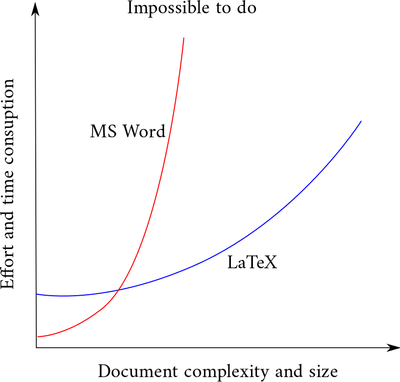

# LaTeX Learning
LaTeX code files, was written in my learning process.

[](LICENSE)

## What is LaTeX?
LaTeX is a **document preparation system** for high-quality typesetting. It is most often used for medium-to-large **technical** or **scientific** documents but it can be used for almost any from of publishing.

LaTeX encourages authors not to worry too much about the apprearance of their documents but not concertrante on getting the right content.

**What it is**, not **How it looks**.

## Why should I use LaTeX?
* Small files.
* Cross-platform compatibility
* Easy to make templates.
* Free.

## MS Word vs LaTeX


## How does it work?
1. You write your document in plain text with commands that describe its structure and meaning.
2. The latex program processes your text and commands to produce a beautifully formatted document.

## Required Tools
* Compiler
  * Gnu/Linux (TexLive)
  * Mac (MacTex)
  * Windows (MIKTeX)
* Editor
  * TeXstudio, Texmaker, ...
* Or use web-based Online Editors
  * www.sharelatex.com
  * www.writelatex.com

## Get Started
* Typesetting
  * comment: `% this is comment`
  * new line: `\\`
  * spaces: `\quad` or `\qquad`
  * print %, {, ...and more: `\%`, `\{`, ... (use anti-slash before special character)
  * bold: `\textbf{value}`
  * italic: `\textit{value}`
  * underline: `\underline{value}`
  * 3 dots: `\dots`
* Math
  * inline math mode: `$ value $`
  * symbols: `\alpha`, `\beta`, `\omega`, ...
  * sub-script: `X_2`
  * sup-script: `X^2`
  * multi sub or sup script: `x^{2x + 3}` or `x_{2x + 3}` (use brackets)
  * merge between sub and sup script: `\sum_{k=1}^n`
  * fractional: `d=\frac{5x}{y}`
  * equation
  ```latex
     \begin{equation}
        \omega = \sum_{i=1}^{n}w_ix % content of equation
     \end{equation}
  ```
  * label in equation
  ```latex
     \begin{equation}
        \label{omega eq} % name of equation used to refered
        \omega = \sum_{i=1}^{n}w_ix
        \end{equation}
     \ref{omega eq}
   ```
